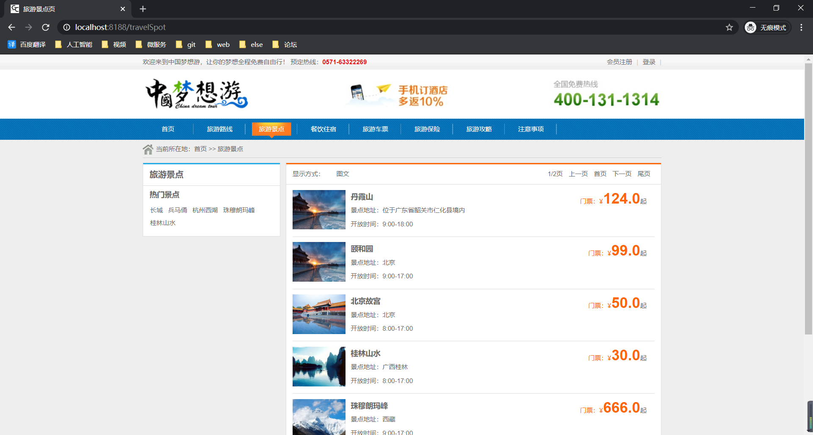
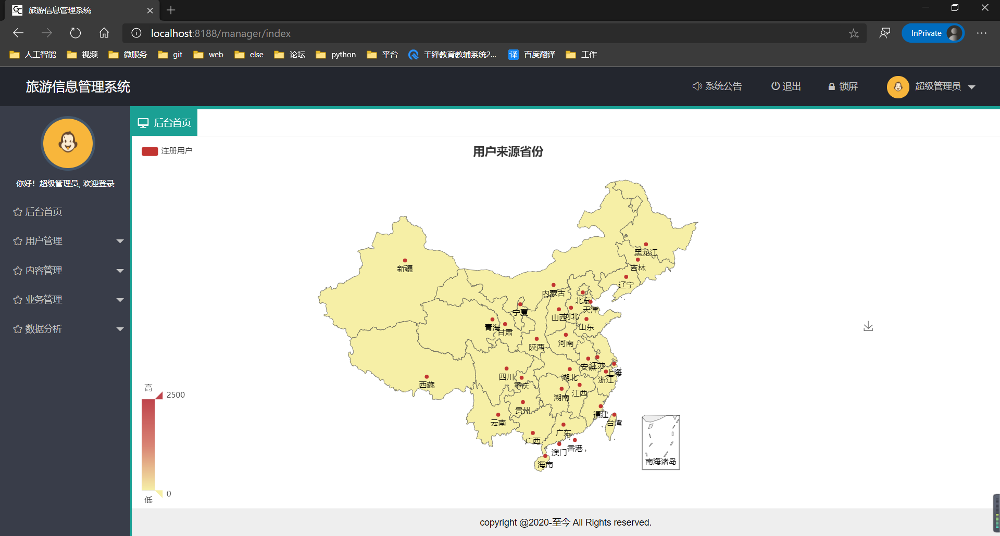

# travel
> 使用SpringBoot+tkMybatis+thymeleaf+layui实现简单旅游项目  
>练习一些简单设计模式和熟悉一下OOP

#### 前台

portal：
- 主页页面
- 车票页面
- 酒店页面
- 保险页面
- 留言显示
- 订单创建更改支付状态
- 景点页面
- 路线页面
- 用户中心（info）
- 用户页面（登录注册等） 

地址：http://localhost/index
账号：user  密码：123456

#### 后台

地址：http://localhost/login
账号：root  密码：123456

- 后台首页
- 用户管理：注册用户和系统用户的管理
- 内容管理：  
    旅游路线、旅游景点、旅游酒店、旅游车票、旅游保险、旅游策略、订单管理、留言管理、数据分析等等。
- 业务管理：处理订单
- 数据分析：内容管理里的数据分析